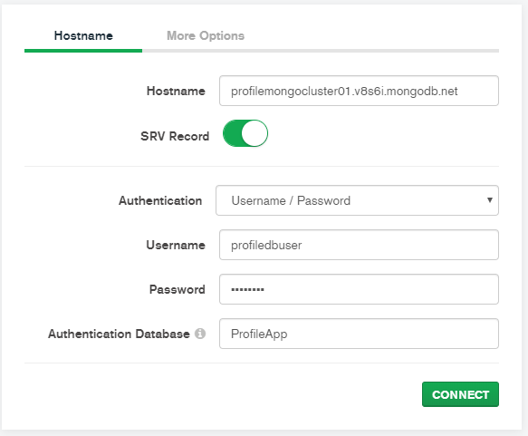
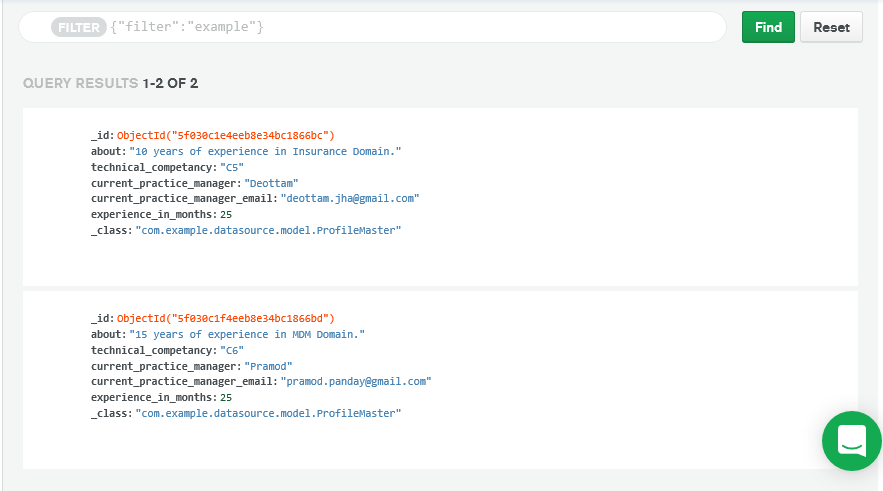

# Connect-MongoDB-Cloud-With-SpringBoot

Step to Connect MongoDB Cloud Using Spring Boot

1. First Connect to MongoDB Cloud by using MongoDB Compass Community .

syntex::
```
mongodb+srv://<username>:<password>@<hostname>/<dbname>
```
Example::
```
mongodb+srv://profiledbuser:<password>@profilemongocluster01.v8s6i.mongodb.net/ProfileApp
```

                 or
   



2. In Properties File, you have to add two key-value pairs.

```
spring.data.mongodb.uri=mongodb+srv://profiledbuser:<password>@profilemongocluster01.v8s6i.mongodb.net/ProfileApp?retryWrites=true&w=majority
spring.data.mongodb.database=ProfileApp
```

3. After Running your application you can see your save value in Spring Cloud.



## Note: 

At the time any interaction with MongoDB Cloud, make sure your `VPN` is disconnected.
